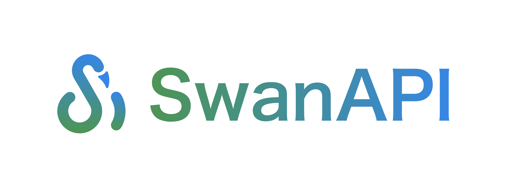

<div align="center">

</div>
<div align="center">
  <a href="https://pypi.org/project/swanapi" target="_blank">
    </a>
</div>
 <p align="center"><a href="README_EN.md">English</a></p>

 <br>

## 🥳已实现功能

1. 零门槛极速生成模型API
2. 零门槛极速打包深度学习镜像
   - 支持Linux/Win/WSL/MacOS上的CPU Docker镜像快速打包
   - 支持Linux/Win/WSL上的GPU Docker镜像快速打包
3. [使用案例](https://github.com/SwanHubX/SwanAPI_Examples)

<br>

## 📚依赖

- Paython3.7+
- Docker. SwanAPI使用Docker来为你的模型创建容器, 在你运行SwanAPI的镜像打包功能之前, 你需要[安装Docker](https://docs.docker.com/get-docker/)。

<br>

## 🔧安装

<a href="https://pypi.org/project/swanapi" target="_blank">
    </a>

```bash
pip install swanapi -i https://pypi.org/simple
```

<br>

## 🚀本地API服务

1. 写一个`predict.py`文件, 这里我们以图像转黑白进行举例：

> 如果你之前写过Gradio，一定对这种写法并不陌生，与定义`gr.Interface`的方法非常类似。

```python
from swanapi import SwanInference
import cv2

# 这是一个简单的图像转黑白的任务
def predict(im):
    result_image = cv2.cvtColor(im, cv2.COLOR_BGR2GRAY)
    return "success", result_image

if __name__ == "__main__":
    api = SwanInference()
    api.inference(predict,
                  inputs=['image'],
                  outputs=['text', 'image'],
                  description="a simple test")
    api.launch()
```
<br>

2. 运行`python predict.py`，即可在`localhost://127.0.0.1:8000/`上运行一个API推理服务:

```console
$ python predict.py
 * Serving Flask app "SwanAPI Server" (lazy loading)
 * Environment: production
   WARNING: This is a development server. Do not use it in a production deployment.
   Use a production WSGI server instead.
 * Debug mode: off
 * Running on http://0.0.0.0:8000/ (Press CTRL+C to quit)
```
<br>

3. 调用API

```python
from swanapi import SwanRequests, Files

response = SwanRequests(
    url="http://127.0.0.1:8000/predictions/",
    inputs={'im': Files("/path/to/image")})  #填写图像文件的本地路径

print(response) 
```

> 如果用`curl`发送请求：

```
curl --location 'http://127.0.0.1:8000/predictions/' \
--form 'im=@"path/to/image"'
```

> outputs设置为'image'时，返回base64编码后的字节流，在python中转换为np.ndarray：

```python
from swanapi import SwanRequests, Files
import base64
import numpy as np
import cv2

response = SwanRequests(
    url="http://127.0.0.1:8000/predictions/",
    inputs={'im': Files("../Feedback/assets/FeedBack.png")})  #填写图像文件的本地路径

image_base64 = response[str(1)]['content']
nparr = np.frombuffer(base64.b64decode(image_base64), np.uint8)
img_restore = cv2.imdecode(nparr, cv2.IMREAD_COLOR)

cv2.imwrite("output.jpg", img_restore)
```
<br>


## 🚀快速创建API镜像

在开发`predict.py`完成后：

1. 创建一个`swan.yaml`文件，它将指导你的镜像构建：

```
build:
  gpu: false
  system_packages:
    - "libgl1-mesa-glx"
    - "libglib2.0-0"
  python_version: "3.10"
  python_packages:
    - "numpy"
    - "opencv-python"
predict:
  port: 8000
```

build：

- `gpu`: 是否开启gpu模式。true将根据你的硬件配置、python_version以及深度学习框架自动选择最佳的nvidia支持。

- `system_packages`: Linux系统基础库，将使用`apt-get install`它们。

- `python_version`: 镜像运行的基础Python版，支持3.8, 3.9, 3.10。

- `python_packages`: 你的模型依赖的Python库
  - 如果python库需要指定安装源，可写作`- "torch==2.0.0 --index-url https://download.pytorch.org/whl/cpu"`
  
- `python_source`：指定python库的下载源，可选`cn`和`us`，默认`us`。选择`cn`的下载源将使用`清华源`

predict：

- `port`：推理服务开启时的端口号

<br>

2. 构建镜像：

```
swan build -t my-dl-image
```

swan build可选参数：

- `-t`: 必选。指定镜像构建的名称，如`my-dl-image`。
- `-r`: 可选。如果加上该参数，构建好镜像后将运行容器，并做好了端口映射：`swan build -r -t my-dl-image`
- `-s`: 可选。如果加上该参数，构建好镜像后将在目录下保存Dockefile。

<br>

3. 运行容器：

- cpu

```bash
docker run my-dl-image
```

- gpu

```
docker run --gpus all my-dl-image
```

<br>

## 🏠贡献者

<a href="https://github.com/BlackSwanXDU/SwanAPI/graphs/contributors">
  </a>

