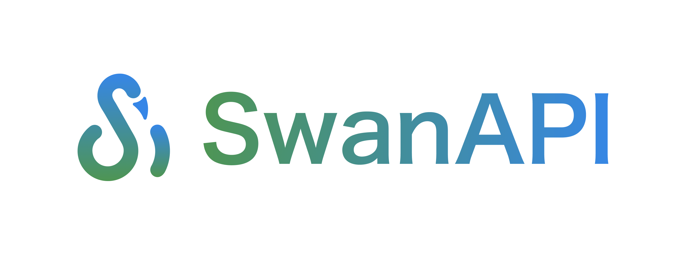

<div align="center">

</div>


<div align="center">
  <a href="https://pypi.org/project/swanapi" target="_blank">
    </a>
</div>

<span style="text-align:center; display:inline-block; width:100%">[中文文档](README.md)</span>

## ⬆️Intended function

1. One-stop packaging of deep learning images

- Simply write configuration files and inference files
- No worries about installing mainstream machine learning libraries such as PyTorch, TensorFlow, Transformers, etc.
- No worries about GPU environment configuration such as CUDA, cudnn, etc.
- The image runtime will run a high-performance API service for easy invocation.

1. Push images for cloud hosting
2. Generate local debugging GUI interface and API documentation.


## 📚Requirements

- Paython3.7+
- Docker. SwanAPI uses Docker to create containers for your models, and before you can run SwanAPI, you need to[Install Docker](https://docs.docker.com/get-docker/)。


## 🔧Install

```
pip install swanapi -i https://pypi.org/simple
```


## 🚀How it works

Define the Docker environment your model runs in with `swan.yaml`:

```yaml
build:
  gpu: false
  system_packages:
    - "libgl1-mesa-glx"
    - "libglib2.0-0"
  python_version: "3.10"
  python_packages:
    - "numpy"
    - "onnxruntime"
    - "opencv-python"
predict:
  port: 8000
```

If you are in China, you can add `python_source: "cn"` under build to use Tsinghua mirror to install `python_packages`.

In `predict.py`, define how your model performs inference. We use a code style similar to [Gradio](https://github.com/gradio-app/gradio).

```python
import cv2
from swanapi import SwanInference

def predict(image):
    result_image = cv2.cvtColor(image, cv2.COLOR_BGR2GRAY)
    return result_image

if __name__ == "__main__":
    api = SwanInference()
    api.inference(predict,
                  inputs=['image'],
                  outputs=['image'],
                  description="a simple test")
    api.launch()
```

- 2023.7.8: v0.1.3 supports three types: `text`, `image`, and `number`


## 💻Server

Now you can directly turn the model into a prediction service.

```console
$ python predict.py
 * Serving Flask app "app" (lazy loading)
 * Environment: production
   WARNING: This is a development server. Do not use it in a production deployment.
   Use a production WSGI server instead.
 * Debug mode: off
 * Running on http://0.0.0.0:8000/ (Press CTRL+C to quit)
```

You can also build a deep learning inference image with just one command.

```console
$ swanapi build -t my-dl-model
--> Building Docker Image...
--> Building Docker Finish.
 * Serving Flask app "app" (lazy loading)
 * Environment: production
   WARNING: This is a development server. Do not use it in a production deployment.
   Use a production WSGI server instead.
 * Debug mode: off
 * Running on http://0.0.0.0:8000/ (Press CTRL+C to quit)
```

---

Request your model inference service (taking image-to-image task as an example):

- **Python**

```python
import requests
url = "http://127.0.0.1:8000/predictions/"
files = [('image', ('test.jpg', open('./test.jpg', 'rb'), 'image/jpeg'))]
response = requests.request("POST", url, files=files)
print(response.text)
```

- **cURL**

```bash
curl --location 'http://127.0.0.1:8000/predictions/' \
--form 'image=@"./test.jpf"'
```

---

The obtained JSON will be: {"content":"base64"}

Once you decode the base64, you will obtain the image file.

```python
import base64
import numpy as np
import cv2

image_base64 = response.text['content']
nparr = np.fromstring(base64.b64decode(image_base64), np.uint8)
img_restore = cv2.imdecode(nparr, cv2.IMREAD_COLOR)
```

